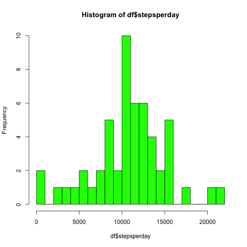
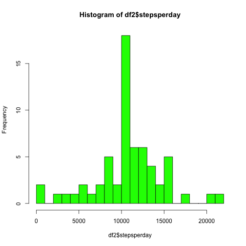
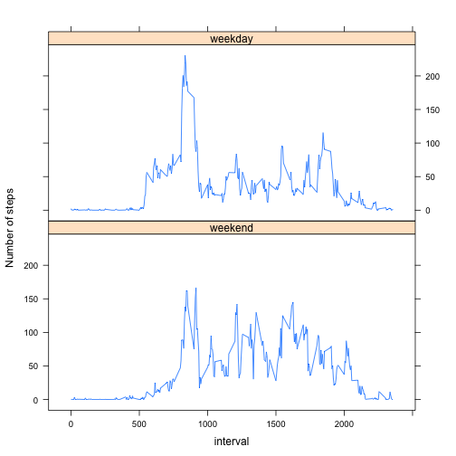

#Peer assessment 1


##Loading and processing the data

1. Load the data (i.e. read.csv())

```r
activity <- read.csv("activity.csv", colClasses = c("numeric", "character", "numeric"))
```
2. Process/transform the data (if necessary) into a format suitable for your analysis


##What is mean total number of steps taken per day?
1. Make a histogram of the total number of steps taken each day

```r
test <- lapply(split(activity$steps,activity$date), sum) 
df <- data.frame(matrix(unlist(test), byrow=T))
colnames(df)[1] <- "stepsperday"
hist(df$stepsperday, col = "green", breaks = 20)
```

 

2. Calculate and report the mean and median total number of steps taken per day

```r
mean(df$stepsperday, na.rm = TRUE)
```

```
## [1] 10766.19
```

```r
median(df$stepsperday, na.rm = TRUE)
```

```
## [1] 10765
```

##What is the average daily activity pattern?
1. Make a time series plot (i.e. type = "l") of the 5-minute interval (x-axis) and the average number of steps taken, averaged across all days (y-axis)

```r
test <- lapply(split(activity$steps,activity$interval), mean, na.rm = TRUE)
df <- data.frame(matrix(unlist(test), byrow=T))
colnames(df)[1] <- "stepsperinterval"
bind <- cbind(df$stepsperinterval, head(activity$interval, 288))
colnames(bind) <- c("Number_of_steps", "interval")
with(as.data.frame(bind), plot(interval, Number_of_steps, type="l"))
```

 

2.Which 5-minute interval, on average across all the days in the dataset, contains the maximum number of steps?

```r
dfbind <- as.data.frame(bind)
for(i in 1:nrow(dfbind)){
    if(max(dfbind$stepsperinterval)==dfbind$stepsperinterval[i]){
        max <- data.frame(dfbind[i,])
    }
}
```

```
## Warning in max(dfbind$stepsperinterval): no non-missing arguments to max;
## returning -Inf
```

```
## Error in if (max(dfbind$stepsperinterval) == dfbind$stepsperinterval[i]) {: argument is of length zero
```

```r
print(max)
```

```
##     stepsperinterval interval
## 104         206.1698      835
```

##Imputing missing values
1. Calculate and report the total number of missing values in the dataset (i.e. the total number of rows with NAs)

```r
sum(is.na(activity$steps))
```

```
## [1] 2304
```

2. Devise a strategy for filling in all of the missing values in the dataset. The strategy does not need to be sophisticated. For example, you could use the mean/median for that day, or the mean for that 5-minute interval, etc.

First, calculate the mean for that 5-minute interval first and then create a new dataset with NA replacement. 

```r
test <- lapply(split(activity$steps,activity$interval), mean, na.rm = TRUE)
df <- data.frame(matrix(unlist(test), byrow=T))
colnames(df)[1] <- "stepsperinterval"
bind <- cbind(df$stepsperinterval, head(activity$interval, 288))
colnames(bind) <- c("stepsperinterval", "interval")
bind <- as.data.frame(bind)
```

3. Create a new dataset that is equal to the original dataset but with the missing data filled in.

```r
for(i in 1:nrow(activity)){
    for(j in 1:nrow(bind)){
        if(is.na(activity$steps[i]) && activity$interval[i] == bind$interval[j]){
            activity$steps[i] <- bind$stepsperinterval[j]
        }
    }
}
activity2 <- activity
print(head(activity2))
```

```
##       steps       date interval
## 1 1.7169811 2012-10-01        0
## 2 0.3396226 2012-10-01        5
## 3 0.1320755 2012-10-01       10
## 4 0.1509434 2012-10-01       15
## 5 0.0754717 2012-10-01       20
## 6 2.0943396 2012-10-01       25
```

4. Make a histogram of the total number of steps taken each day and Calculate and report the mean and median total number of steps taken per day. Do these values differ from the estimates from the first part of the assignment? What is the impact of imputing missing data on the estimates of the total daily number of steps?

```r
test <- lapply(split(activity2$steps,activity2$date), sum) 
df2 <- data.frame(matrix(unlist(test), byrow=T))
colnames(df2)[1] <- "stepsperday"
hist(df2$stepsperday, col = "green", breaks = 20)
```

 
Impact: Enlarge the difference between each day of total daily number of steps.

##Are there differences in activity patterns between weekdays and weekends?
1. Create a new factor variable in the dataset with two levels -- "weekday" and "weekend" indicating whether a given date is a weekday or weekend day.

```r
ibrary(lubridate)
```

```
## Error in eval(expr, envir, enclos): could not find function "ibrary"
```

```r
week <- data.frame(week = "", stringsAsFactors = FALSE)
bind <- cbind(activity, week)
for(i in 1:nrow(bind)){
    if(wday(bind$date[i])==1 || wday(bind$date[i])==7){
        bind$week[i] <- "weekend"
    }else{
        bind$week[i] <- "weekday"
    } 
}
```

2. Make a panel plot containing a time series plot (i.e. type = "l") of the 5-minute interval (x-axis) and the average number of steps taken, averaged across all weekday days or weekend days (y-axis). The plot should look something like the following, which was created using simulated data:

```r
weekend <- bind[bind$week %in% c("weekend"), ]
weekday <- bind[bind$week %in% c("weekday"), ]

test <- lapply(split(weekend$steps,weekend$interval), mean, na.rm = TRUE)
df <- data.frame(matrix(unlist(test), byrow=T))
colnames(df)[1] <- "Number_of_steps"
bind <- cbind(df$Number_of_steps, head(activity$interval, 288))
colnames(bind) <- c("Number_of_steps", "interval")
bind <- as.data.frame(bind)

test <- lapply(split(weekday$steps,weekday$interval), mean, na.rm = TRUE)
df <- data.frame(matrix(unlist(test), byrow=T))
colnames(df)[1] <- "Number_of_steps"
bind2 <- cbind(df$Number_of_steps, head(activity$interval, 288))
colnames(bind2) <- c("Number_of_steps", "interval")
bind <- as.data.frame(bind)

total <- rbind(bind, bind2)
f <- rep(0:1, each = 288)
f <- factor(f, labels = c("weekend", "weekday"))
xyplot(total$Number_of_steps~total$interval|f, layout = c(1,2), type="l", ylab="Number of steps", xlab="interval")
```

 
